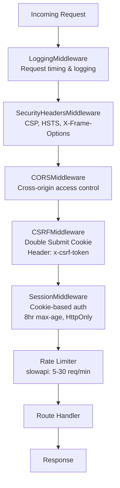
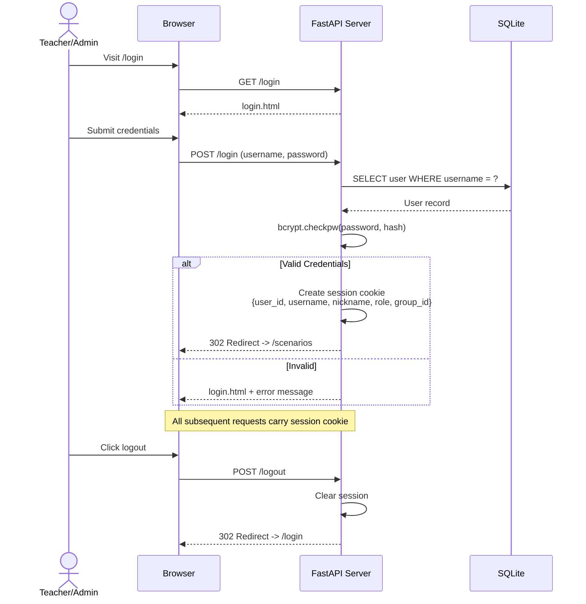
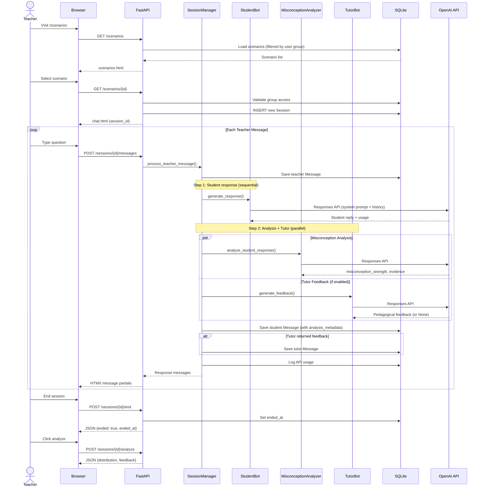
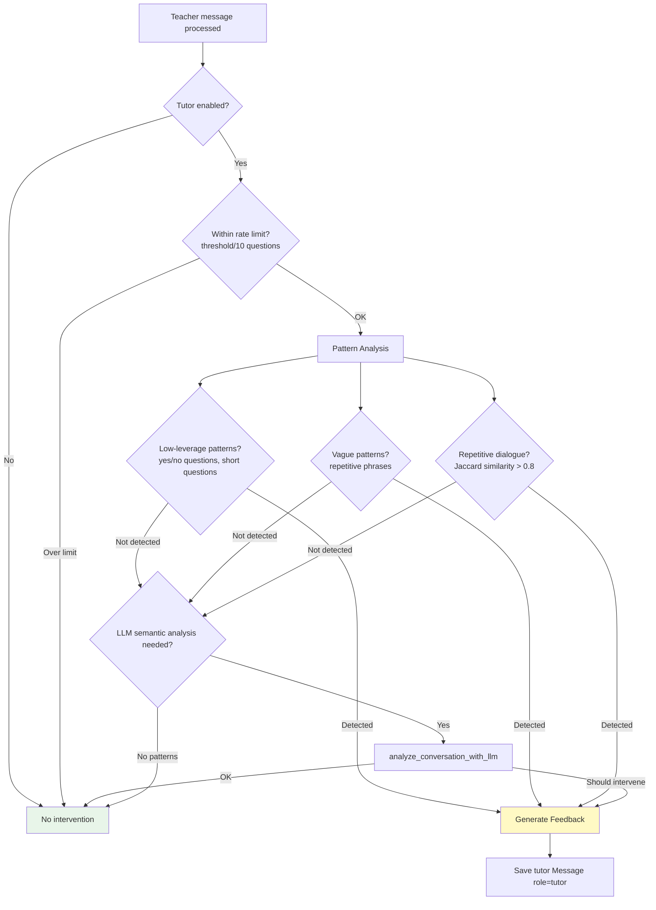
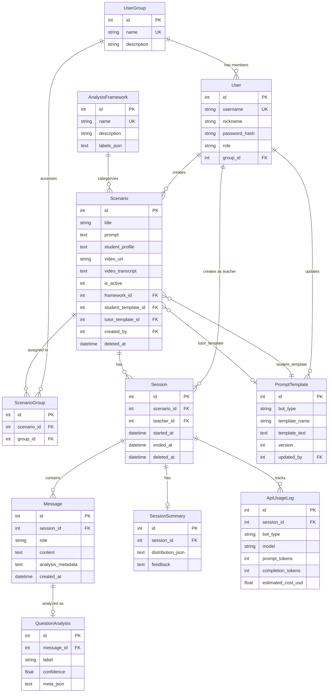
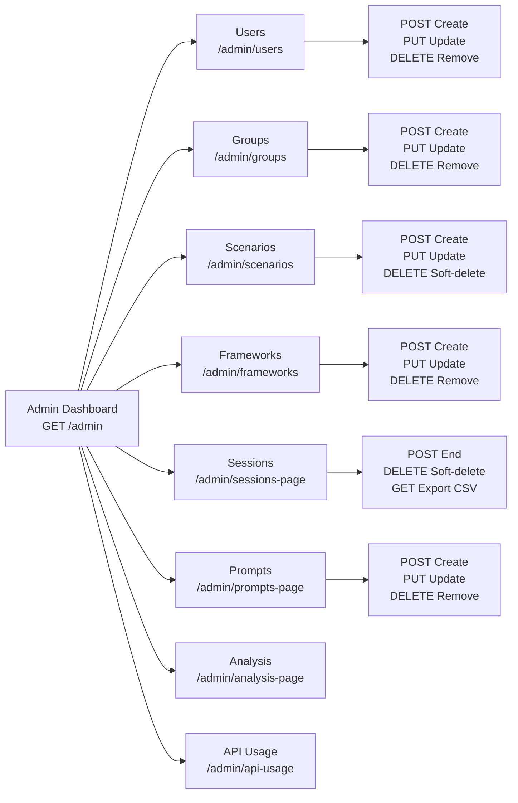
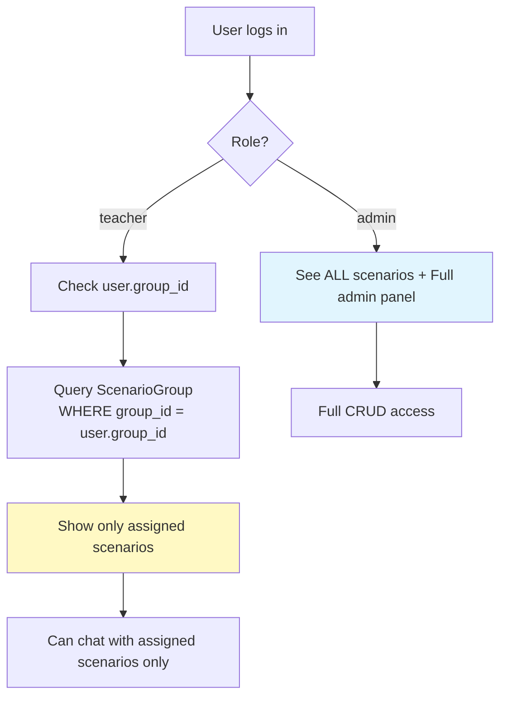
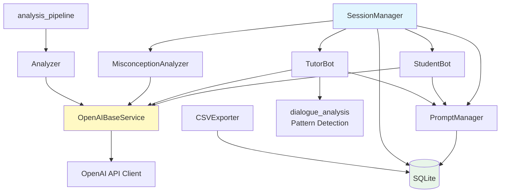

# Misconcept Platform - System Architecture & Flow

> **Last Updated**: 2026-02-15
> **Version**: 1.0

---

## 1. System Overview

**"Misconception Correction Dialogue Simulator"** - AI-powered platform where teachers practice questioning skills by conversing with an AI student bot that deliberately holds misconceptions.

```
+---------------------------------------------------------------+
|                      Browser (HTMX + JS)                      |
+---------------------------------------------------------------+
         |                    |                    |
    [Login/Auth]        [Teacher Chat]       [Admin Panel]
         |                    |                    |
+---------------------------------------------------------------+
|                    FastAPI Application                         |
|  +----------+  +----------+  +----------+  +----------+      |
|  |   Auth   |  | Sessions |  | Scenarios|  |  Admin   |      |
|  |  Routes  |  |  Routes  |  |  Routes  |  |  Routes  |      |
|  +----------+  +----------+  +----------+  +----------+      |
|       |              |              |              |           |
|  +----+--------------+--------------+-----------+  |          |
|  |              Service Layer                    |  |          |
|  |  SessionManager | StudentBot | TutorBot      |  |          |
|  |  Analyzer | MisconceptionAnalyzer | Export   |  |          |
|  +----------------------------------------------+  |          |
|       |                                             |          |
|  +----+---------------------------------------------+         |
|  |          SQLAlchemy ORM (Async)                   |         |
|  +---------------------------------------------------+        |
+---------------------------------------------------------------+
         |                                      |
   +----------+                          +----------+
   |  SQLite  |                          | OpenAI   |
   |   (WAL)  |                          | API      |
   +----------+                          +----------+
```

---

## 2. Middleware Stack

Requests pass through middleware in the following order:



**CSRF Exempt URLs**: `/health`, `/metrics`, `/login`, `/logout`

---

## 3. Authentication Flow



---

## 4. Main Dialogue Flow (Core Feature)



---

## 5. Analysis Pipeline

```mermaid
flowchart TD
    START[POST /sessions/{id}/analyze] --> LOAD[Load all Messages from session]
    LOAD --> FILTER[Filter Greetings - Analyzer.detect_greetings]
    FILTER --> CLASSIFY[Classify each question - Analyzer.classify_question]
    CLASSIFY --> |For each teacher message| LLM[OpenAI Responses API<br/>Classify into framework labels]
    LLM --> QA[Save QuestionAnalysis - label + confidence]
    QA --> DIST[Calculate distribution - Count per label]
    DIST --> SUMM[Create SessionSummary - distribution_json + feedback]
    SUMM --> DONE[Return analysis result]

    CLASSIFY --> |Error| FB[create_fallback_summary - Uniform distribution]
    FB --> DONE

    style START fill:#e1f5fe
    style DONE fill:#e8f5e9
    style FB fill:#fff3e0
```

**Framework Labels Example** (High/Low Leverage):
- Pressing (for reasoning)
- Linking (to prior knowledge)
- Directing (closed questions)
- Recall (factual recall)

---

## 6. Tutor Intervention Decision Flow



---

## 7. Data Model (Entity Relationship)



---

## 8. Admin Panel Flow



---

## 9. Group-Based Access Control



**Access Rules**:
- **Admin**: Full access to all scenarios and admin panel
- **Teacher**: Can only see scenarios assigned to their group via ScenarioGroup join table
- **No group assigned**: Teacher sees no scenarios

---

## 10. Technology Stack

| Layer | Technology |
|-------|-----------|
| Frontend | HTMX + Vanilla JS + Jinja2 Templates |
| Styling | Custom CSS (CSS Variables) |
| Web Framework | FastAPI (async) |
| ORM | SQLAlchemy 2.x (async) |
| Database | SQLite3 (WAL mode) |
| Auth | Starlette SessionMiddleware + bcrypt |
| Security | CSRF (Double Submit Cookie) + CSP |
| AI/LLM | OpenAI Responses API (GPT-5 family) |
| Rate Limiting | slowapi (5-30 req/min per endpoint) |
| Retry | tenacity (3 attempts, exp backoff) |
| Logging | Structured JSON (stdlib logging) |
| Package Mgmt | uv |

---

## 11. Key Service Dependencies



---

## 12. File Structure Summary

```
src/
  main.py                       # App entry, middleware, lifespan
  config.py                     # Environment config (Pydantic)
  models/
    user.py                     # User (teacher/admin)
    user_group.py               # UserGroup
    scenario.py                 # Scenario (with template FKs)
    scenario_group.py           # ScenarioGroup (join table)
    analysis_framework.py       # AnalysisFramework (labels)
    session.py                  # Session (dialogue session)
    message.py                  # Message (teacher/student/tutor)
    question_analysis.py        # QuestionAnalysis (per-question)
    session_summary.py          # SessionSummary (distribution)
    prompt_template.py          # PromptTemplate (student/tutor)
    api_usage.py                # ApiUsageLog (token tracking)
  services/
    base.py                     # OpenAI base with retry
    student_bot.py              # Student persona bot
    tutor_bot.py                # Tutor intervention bot
    misconception_analyzer.py   # Misconception strength check
    session_mgr.py              # Dialogue orchestration
    analyzer.py                 # Question classification
    analysis_pipeline.py        # Full analysis workflow
    dialogue_analysis.py        # Pattern detection utils
    prompt_manager.py           # Template CRUD
    export.py                   # CSV export (anonymized)
  api/
    dependencies.py             # Auth dependencies
    schemas.py                  # Pydantic request/response models
    routes/
      auth.py                   # Login/Logout
      health.py                 # Health/Metrics
      scenarios.py              # Scenario listing/access
      sessions.py               # Session create/close
      session_messages.py       # Message send/poll
      session_analysis.py       # Analysis trigger/view
      admin.py                  # Admin dashboard
      admin_users.py            # User CRUD
      admin_groups.py           # Group CRUD
      admin_scenarios.py        # Scenario CRUD
      admin_frameworks.py       # Framework CRUD
      admin_sessions.py         # Session listing
      admin_session_actions.py  # Session end/delete/detail
      admin_session_export.py   # CSV export
      admin_session_stats.py    # Statistics
      admin_analysis.py         # Analysis management
      admin_api_usage.py        # API usage dashboard
      admin_prompts.py          # Prompt CRUD
  db/
    connection.py               # Async engine + session factory
    init_schema.py              # DDL schema
    seed.py                     # Default data seeding
    migrations/                 # SQL migrations (001-007)
  templates/                    # Jinja2 HTML templates
  prompts/                      # Default prompt text files
```

---

## 13. API Endpoints Summary

| Method | Path | Rate | Auth | Description |
|--------|------|------|------|-------------|
| GET | /login | - | No | Login page |
| POST | /login | 5/min | No | Authenticate |
| POST | /logout | - | Yes | Clear session |
| GET | /scenarios | - | Yes | List scenarios |
| GET | /scenarios/{id} | - | Yes | Enter scenario + create session |
| POST | /sessions | 10/min | Yes | Create session (JSON) |
| POST | /sessions/{id}/messages | 30/min | Yes | Send message |
| GET | /sessions/{id}/messages/updates | - | Yes | Poll new messages |
| POST | /sessions/{id}/end | 10/min | Yes | End session |
| POST | /sessions/{id}/close | 30/min | Yes | Close session (idempotent) |
| POST | /sessions/{id}/analyze | 5/min | Yes | Run analysis |
| GET | /sessions/{id}/analysis | - | Yes | Get analysis JSON |
| GET | /sessions/{id}/analysis_page | - | Yes | Analysis page |
| GET | /sessions/{id}/analysis_modal | - | Yes | Analysis modal (HTMX) |
| GET | /sessions/{id}/export.csv | - | Yes | Export CSV |
| GET | /health | - | No | Health check |
| GET | /metrics | - | No | System metrics |
| GET | /admin | - | Admin | Dashboard |
| GET/POST | /admin/users | - | Admin | List/Create users |
| PUT/DELETE | /admin/users/{id} | - | Admin | Update/Delete user |
| GET/POST | /admin/groups | - | Admin | List/Create groups |
| PUT/DELETE | /admin/groups/{id} | - | Admin | Update/Delete group |
| GET/POST | /admin/scenarios | - | Admin | List/Create scenarios |
| PUT/DELETE | /admin/scenarios/{id} | - | Admin | Update/Delete scenario |
| GET/POST | /admin/frameworks | - | Admin | List/Create frameworks |
| PUT/DELETE | /admin/frameworks/{id} | - | Admin | Update/Delete framework |
| GET/POST | /admin/prompts | - | Admin | List/Create prompts |
| PUT/DELETE | /admin/prompts/{id} | - | Admin | Update/Delete prompt |
| GET | /admin/sessions-page | - | Admin | Session logs |
| GET | /admin/sessions/export | - | Admin | Export sessions CSV |
| GET | /admin/analysis-page | - | Admin | Analysis management |
| GET | /admin/api-usage | - | Admin | API usage dashboard |
| GET | /admin/stats | - | Admin | System statistics |
