# 챗봇 설정 기능 삭제 실행 계획

**기반 문서**: `modify/delete.md`
**실행 전략**: Phase별 전문 Agent 할당 + 병렬 Sub-Agent 처리
**예상 소요 시간**: 2-3 시간 (병렬 처리 시)

---

## 실행 개요

### Agent 할당 전략

| Phase | 주 담당 Agent | 보조 Agent | 병렬 처리 |
|-------|--------------|-----------|----------|
| Phase 1 | backend-architect | - | 순차 |
| Phase 2 | backend-architect | - | 순차 |
| Phase 3 | refactoring-expert | backend-architect | **병렬 가능** |
| Phase 4 | refactoring-expert | - | **병렬 가능** |
| Phase 5 | backend-architect | - | 순차 |
| Phase 6 | quality-engineer | - | 순차 |
| Phase 7 | technical-writer | - | **병렬 가능** |
| Phase 8 | backend-architect | quality-engineer | 순차 |

### 병렬 처리 기회

```
Phase 3 (코드 수정) ║ Phase 4 (파일 삭제) ║ Phase 7 (문서 업데이트)
     ↓ 병렬 실행 ↓
   완료 후 Phase 5 (DB 마이그레이션)
```

---

## Phase 1: 준비 단계

**담당**: `backend-architect` (시스템 설계 전문가)
**병렬 처리**: ❌ 순차 실행 필수
**예상 시간**: 10분

### Tasks (순차 실행)

#### Task 1.1: Git 브랜치 생성
```bash
Command: git checkout -b feature/remove-chatbot-config-ui
Tools: Bash
Dependencies: None
```

#### Task 1.2: 데이터베이스 백업
```bash
Commands:
  sqlite3 dialogue_sim.db ".dump chatbot_config" > backup_chatbot_config.sql
  sqlite3 dialogue_sim.db ".dump chatbot_config_audit" > backup_config_audit.sql
  sqlite3 dialogue_sim.db ".dump scenario" > backup_scenario.sql

Tools: Bash
Dependencies: Task 1.1 완료
```

#### Task 1.3: 현재 설정값 확인
```sql
SELECT config_key, config_value FROM chatbot_config;
```
```bash
Tools: Bash + sqlite3
Dependencies: Task 1.2 완료
Purpose: .env로 이전할 값 확인
```

**Validation**:
- ✅ 브랜치 생성 확인: `git branch --show-current`
- ✅ 백업 파일 생성 확인: `ls -lh backup_*.sql`
- ✅ 백업 파일 내용 검증: `wc -l backup_*.sql`

---

## Phase 2: .env 설정 추가

**담당**: `backend-architect` (구성 관리 전문가)
**병렬 처리**: ❌ 순차 실행 (Phase 1 의존)
**예상 시간**: 15분

### Tasks (순차 실행)

#### Task 2.1: config.py 수정
**Agent**: backend-architect
**Tool**: Edit
**File**: `src/config.py`

**작업 내용**:
```python
# 추가할 코드 (ANALYSIS_MODEL 아래)
# ===== Chatbot Parameter Configuration =====
# StudentBot settings
STUDENT_TEMPERATURE: float = float(
    os.getenv("STUDENT_TEMPERATURE", "0.7")
)
STUDENT_MAX_TOKENS: int = int(
    os.getenv("STUDENT_MAX_TOKENS", "150")
)

# TutorBot settings
TUTOR_TEMPERATURE: float = float(
    os.getenv("TUTOR_TEMPERATURE", "0.3")
)
TUTOR_MAX_TOKENS: int = int(
    os.getenv("TUTOR_MAX_TOKENS", "100")
)
TUTOR_INTERVENTION_THRESHOLD: int = int(
    os.getenv("TUTOR_INTERVENTION_THRESHOLD", "3")
)
```

**Dependencies**: Phase 1 완료

#### Task 2.2: .env 파일 업데이트
**Agent**: backend-architect
**Tool**: Edit
**File**: `.env`

**추가 내용**:
```bash
# ===== StudentBot Parameters =====
STUDENT_TEMPERATURE=0.7
STUDENT_MAX_TOKENS=150

# ===== TutorBot Parameters =====
TUTOR_TEMPERATURE=0.3
TUTOR_MAX_TOKENS=100
TUTOR_INTERVENTION_THRESHOLD=3
```

**Dependencies**: Task 2.1 완료

#### Task 2.3: .env.example 업데이트
**Agent**: backend-architect
**Tool**: Edit
**File**: `.env.example`

**동일 내용 추가 + 주석**:
```bash
# ===== StudentBot Parameters =====
STUDENT_TEMPERATURE=0.7        # 0.0-2.0 (높을수록 창의적)
STUDENT_MAX_TOKENS=150         # 최대 응답 길이

# ===== TutorBot Parameters =====
TUTOR_TEMPERATURE=0.3          # 0.0-2.0 (일관적인 피드백)
TUTOR_MAX_TOKENS=100           # 최대 피드백 길이
TUTOR_INTERVENTION_THRESHOLD=3 # 질문 10개당 개입 횟수 (1-10)
```

**Dependencies**: Task 2.2 완료

**Validation**:
- ✅ config.py 문법 검사: `python -c "from src.config import config; print(config.STUDENT_TEMPERATURE)"`
- ✅ .env 파싱 확인: `python -c "import os; from dotenv import load_dotenv; load_dotenv(); print(os.getenv('STUDENT_TEMPERATURE'))"`

---

## Phase 3: 코드 수정 (병렬 처리 가능)

**담당**: `refactoring-expert` (코드 품질 전문가) + `backend-architect`
**병렬 처리**: ✅ Task 3.1-3.3 병렬 실행
**예상 시간**: 20분

### Task Group 3A: session_mgr.py 수정 (Sub-Agent 1)

#### Task 3.1: import 제거
**Agent**: refactoring-expert (Sub-Agent 1)
**Tool**: Edit
**File**: `src/services/session_mgr.py`

**변경**:
```python
# 삭제
from src.services.config_cache import bot_config_cache
```

**Dependencies**: Phase 2 완료

---

#### Task 3.2: _load_bot_config() 메서드 리팩토링
**Agent**: refactoring-expert (Sub-Agent 1)
**Tool**: Edit
**File**: `src/services/session_mgr.py`

**변경 전** (195-245줄):
```python
async def _load_bot_config(self, scenario: Scenario) -> dict:
    """Load bot config: Scenario > Global > Env > Default."""
    db_config = await bot_config_cache.get_global_config(self.db)
    # ... (기존 로직)
```

**변경 후**:
```python
def _load_bot_config(self, scenario: Scenario) -> dict:
    """Load bot config from .env and scenario overrides.

    Configuration priority:
    1. Scenario-specific overrides (if set)
    2. Environment variables (.env)
    3. Hardcoded defaults

    Note: Database-based global config removed.
          All defaults now managed via .env.
    """
    return {
        # StudentBot configuration
        "student_model": (
            scenario.chat_model
            or config.CHAT_MODEL
            or "gpt-4-turbo"
        ),
        "student_temperature": (
            scenario.chat_temperature
            if scenario.chat_temperature is not None
            else config.STUDENT_TEMPERATURE
        ),
        "student_max_tokens": config.STUDENT_MAX_TOKENS,

        # TutorBot configuration
        "tutor_enabled": scenario.tutor_enabled,
        "tutor_model": config.ANALYSIS_MODEL or "gpt-3.5-turbo",
        "tutor_temperature": config.TUTOR_TEMPERATURE,
        "tutor_max_tokens": config.TUTOR_MAX_TOKENS,
        "tutor_intervention_threshold": (
            scenario.tutor_intervention_threshold
            if scenario.tutor_intervention_threshold is not None
            else config.TUTOR_INTERVENTION_THRESHOLD
        ),
    }
```

**Dependencies**: Task 3.1 완료

---

### Task Group 3B: user.py 수정 (Sub-Agent 2)

#### Task 3.3: User 모델 relationship 제거
**Agent**: refactoring-expert (Sub-Agent 2)
**Tool**: Edit
**File**: `src/models/user.py`

**변경** (45-47줄 삭제):
```python
# 삭제할 코드
config_updates: Mapped[list["ChatbotConfig"]] = relationship(
    "ChatbotConfig", back_populates="updater"
)
```

**Dependencies**: Phase 2 완료

**병렬 실행**: ✅ Task 3.1-3.2와 독립적으로 실행 가능

---

### Task Group 3C: 라우터 및 import 제거 (Sub-Agent 3)

#### Task 3.4: main.py 라우터 등록 제거
**Agent**: refactoring-expert (Sub-Agent 3)
**Tool**: Edit
**File**: `src/main.py`

**삭제**:
```python
from src.api.routes import admin_chatbot_config

app.include_router(admin_chatbot_config.router)
```

**Dependencies**: Phase 2 완료

---

#### Task 3.5: models/__init__.py import 제거
**Agent**: refactoring-expert (Sub-Agent 3)
**Tool**: Edit
**File**: `src/models/__init__.py`

**삭제**:
```python
from src.models.chatbot_config import ChatbotConfig, ChatbotConfigAudit
```

**Dependencies**: Phase 2 완료

---

#### Task 3.6: dashboard.html 링크 제거
**Agent**: refactoring-expert (Sub-Agent 3)
**Tool**: Edit
**File**: `src/templates/admin/dashboard.html`

**삭제** (106줄):
```html
<a href="/admin/chatbot-config/settings" class="btn btn-secondary">
  🤖 챗봇 설정
</a>
```

**Dependencies**: Phase 2 완료

**병렬 실행**: ✅ Task 3.1-3.3과 독립적으로 실행 가능

---

### Phase 3 병렬 실행 전략

```yaml
parallel_execution:
  sub_agent_1:
    tasks: [Task 3.1, Task 3.2]
    focus: session_mgr.py 리팩토링

  sub_agent_2:
    tasks: [Task 3.3]
    focus: user.py 수정

  sub_agent_3:
    tasks: [Task 3.4, Task 3.5, Task 3.6]
    focus: 라우터 및 import 정리

execution_command: |
  # Claude Code에서 3개 Sub-Agent 병렬 실행
  Task(prompt="session_mgr.py 리팩토링 (Task 3.1-3.2)", subagent_type="refactoring-expert")
  Task(prompt="user.py 수정 (Task 3.3)", subagent_type="refactoring-expert")
  Task(prompt="라우터/import 정리 (Task 3.4-3.6)", subagent_type="refactoring-expert")
```

**Validation**:
- ✅ 문법 검사: `python -m py_compile src/services/session_mgr.py src/models/user.py`
- ✅ Import 검증: `python -c "from src.models import User; from src.services.session_mgr import SessionManager"`
- ✅ 서버 시작 테스트: `uvicorn src.main:app --reload` (30초 대기 후 종료)

---

## Phase 4: 파일 삭제 (병렬 처리 가능)

**담당**: `refactoring-expert` (기술 부채 제거 전문가)
**병렬 처리**: ✅ 모든 Task 병렬 실행 가능
**예상 시간**: 5분

### Task Group 4A: 코드 파일 삭제 (Sub-Agent 1)

#### Task 4.1: 라우트 파일 삭제
```bash
rm src/api/routes/admin_chatbot_config.py
```
**Agent**: refactoring-expert (Sub-Agent 1)
**Tool**: Bash
**Dependencies**: Phase 3 완료

---

#### Task 4.2: 모델 파일 삭제
```bash
rm src/models/chatbot_config.py
```
**Agent**: refactoring-expert (Sub-Agent 1)
**Tool**: Bash
**Dependencies**: Phase 3 완료

---

#### Task 4.3: 서비스 파일 삭제
```bash
rm src/services/config_cache.py
```
**Agent**: refactoring-expert (Sub-Agent 1)
**Tool**: Bash
**Dependencies**: Phase 3 완료

---

### Task Group 4B: 템플릿 및 테스트 삭제 (Sub-Agent 2)

#### Task 4.4: 템플릿 파일 삭제
```bash
rm src/templates/admin/chatbot_settings.html
```
**Agent**: refactoring-expert (Sub-Agent 2)
**Tool**: Bash
**Dependencies**: Phase 3 완료

---

#### Task 4.5: 테스트 파일 삭제
```bash
rm tests/integration/test_admin_chatbot_config.py
```
**Agent**: refactoring-expert (Sub-Agent 2)
**Tool**: Bash
**Dependencies**: Phase 3 완료

---

### Task Group 4C: 문서 파일 삭제 (Sub-Agent 3)

#### Task 4.6: 관리자 가이드 삭제
```bash
rm docs/admin_chatbot_config_guide.md
```
**Agent**: refactoring-expert (Sub-Agent 3)
**Tool**: Bash
**Dependencies**: Phase 3 완료

---

#### Task 4.7: 개발자 가이드 삭제
```bash
rm docs/developer_chatbot_config_guide.md
```
**Agent**: refactoring-expert (Sub-Agent 3)
**Tool**: Bash
**Dependencies**: Phase 3 완료

---

#### Task 4.8: 검증 문서 삭제
```bash
rm docs/tutor_threshold_slider_verification.md
```
**Agent**: refactoring-expert (Sub-Agent 3)
**Tool**: Bash
**Dependencies**: Phase 3 완료

---

### Phase 4 병렬 실행 전략

```yaml
parallel_execution:
  sub_agent_1:
    tasks: [Task 4.1, Task 4.2, Task 4.3]
    focus: 코드 파일 삭제

  sub_agent_2:
    tasks: [Task 4.4, Task 4.5]
    focus: 템플릿 및 테스트 삭제

  sub_agent_3:
    tasks: [Task 4.6, Task 4.7, Task 4.8]
    focus: 문서 파일 삭제

execution_command: |
  # 단일 Bash 명령으로 병렬 삭제
  rm src/api/routes/admin_chatbot_config.py \
     src/models/chatbot_config.py \
     src/services/config_cache.py \
     src/templates/admin/chatbot_settings.html \
     tests/integration/test_admin_chatbot_config.py \
     docs/admin_chatbot_config_guide.md \
     docs/developer_chatbot_config_guide.md \
     docs/tutor_threshold_slider_verification.md
```

**Validation**:
- ✅ 파일 삭제 확인: `ls -l <deleted-files>` (에러 확인)
- ✅ Import 오류 확인: `python -c "import src.api.routes.admin_chatbot_config"` (ImportError 기대)

---

## Phase 5: 데이터베이스 마이그레이션

**담당**: `backend-architect` (데이터베이스 전문가)
**병렬 처리**: ❌ 순차 실행 필수 (Phase 3, 4 의존)
**예상 시간**: 15분

### Tasks (순차 실행)

#### Task 5.1: 마이그레이션 파일 생성
**Agent**: backend-architect
**Tool**: Write
**File**: `src/db/migrations/003_remove_chatbot_config.sql`

**내용**:
```sql
-- Migration: Remove chatbot configuration tables
-- Reason: Settings moved to .env for simplification
-- Date: 2025-11-07

-- ============================================
-- Drop tables (audit first for FK constraint)
-- ============================================
DROP TABLE IF EXISTS chatbot_config_audit;
DROP TABLE IF EXISTS chatbot_config;

-- ============================================
-- Remove scenario bot config columns
-- SQLite doesn't support DROP COLUMN directly
-- Need to recreate table without these columns
-- ============================================

-- 1. Create new scenario table without bot config columns
CREATE TABLE scenario_new (
    id INTEGER PRIMARY KEY AUTOINCREMENT,
    title VARCHAR(200) NOT NULL,
    prompt TEXT NOT NULL,
    student_profile TEXT,
    framework_id INTEGER REFERENCES framework(id),
    created_by INTEGER NOT NULL REFERENCES user(id),
    created_at TIMESTAMP DEFAULT CURRENT_TIMESTAMP,
    is_active BOOLEAN DEFAULT 1
);

-- 2. Copy data from old table
INSERT INTO scenario_new (
    id, title, prompt, student_profile,
    framework_id, created_by, created_at, is_active
)
SELECT
    id, title, prompt, student_profile,
    framework_id, created_by, created_at, is_active
FROM scenario;

-- 3. Drop old table and rename new table
DROP TABLE scenario;
ALTER TABLE scenario_new RENAME TO scenario;

-- 4. Recreate indexes
CREATE INDEX IF NOT EXISTS idx_scenario_framework
    ON scenario(framework_id);
CREATE INDEX IF NOT EXISTS idx_scenario_active
    ON scenario(is_active);
```

**Dependencies**: Phase 3, 4 완료

---

#### Task 5.2: 마이그레이션 실행
```bash
sqlite3 dialogue_sim.db < src/db/migrations/003_remove_chatbot_config.sql
```
**Agent**: backend-architect
**Tool**: Bash
**Dependencies**: Task 5.1 완료

---

#### Task 5.3: 마이그레이션 검증
```sql
-- 테이블 삭제 확인
.tables
-- chatbot_config, chatbot_config_audit가 없어야 함

-- scenario 스키마 확인
.schema scenario
-- chat_model, chat_temperature 등 컬럼이 없어야 함

-- 데이터 무결성 확인
SELECT COUNT(*) FROM scenario;
```
**Agent**: backend-architect
**Tool**: Bash
**Dependencies**: Task 5.2 완료

**Validation**:
- ✅ 테이블 존재 확인: `sqlite3 dialogue_sim.db ".tables" | grep -v chatbot_config`
- ✅ Scenario 데이터 확인: `sqlite3 dialogue_sim.db "SELECT COUNT(*) FROM scenario;"`
- ✅ Foreign key 무결성: `sqlite3 dialogue_sim.db "PRAGMA foreign_key_check;"`

---

## Phase 6: 테스트 및 검증

**담당**: `quality-engineer` (품질 보증 전문가)
**병렬 처리**: ❌ 순차 실행 (Phase 5 의존)
**예상 시간**: 25분

### Tasks (순차 실행)

#### Task 6.1: 서버 시작 검증
```bash
uvicorn src.main:app --reload --host 0.0.0.0 --port 8000
# 30초 대기 후 health check
curl http://localhost:8000/health
```
**Agent**: quality-engineer
**Tool**: Bash
**Dependencies**: Phase 5 완료

---

#### Task 6.2: 기능 테스트 (수동)
**Agent**: quality-engineer
**Tool**: Manual Testing + Playwright (선택적)

**테스트 시나리오**:
1. 로그인 (admin/admin)
2. 시나리오 선택
3. 채팅 시작
4. 교사 메시지 전송
5. StudentBot 응답 확인
6. TutorBot 응답 확인 (임계값 기반)

**예상 결과**:
- ✅ StudentBot: temperature=0.7, max_tokens=150 사용
- ✅ TutorBot: temperature=0.3, max_tokens=100, threshold=3 사용
- ✅ 관리자 대시보드에 "챗봇 설정" 버튼 없음
- ✅ `/admin/chatbot-config/*` 접근 시 404 에러

**Dependencies**: Task 6.1 완료

---

#### Task 6.3: 테스트 Suite 실행
```bash
pytest tests/ -v --cov=src --cov-report=term-missing
```
**Agent**: quality-engineer
**Tool**: Bash
**Dependencies**: Task 6.2 완료

**예상 결과**:
- ✅ 모든 테스트 통과 (test_admin_chatbot_config.py 제외)
- ✅ Coverage ≥ 80% 유지
- ⚠️ Coverage 감소는 정상 (삭제된 코드 제외)

---

#### Task 6.4: 로그 확인
```bash
# 서버 로그에서 에러 검색
tail -n 100 <log-file> | grep -i error
```
**Agent**: quality-engineer
**Tool**: Bash
**Dependencies**: Task 6.3 완료

**Validation**:
- ✅ 서버 시작 성공 (포트 8000 리스닝)
- ✅ 기능 테스트 통과
- ✅ 단위 테스트 통과
- ✅ 에러 로그 없음

---

## Phase 7: 문서 업데이트 (병렬 처리 가능)

**담당**: `technical-writer` (기술 문서 전문가)
**병렬 처리**: ✅ Task 7.1-7.3 병렬 실행 가능
**예상 시간**: 20분

### Task Group 7A: README 업데이트 (Sub-Agent 1)

#### Task 7.1: README.md 챗봇 설정 섹션 수정
**Agent**: technical-writer (Sub-Agent 1)
**Tool**: Edit
**File**: `README.md`

**변경 전** (추정):
```markdown
## 챗봇 설정

관리자는 웹 UI를 통해 StudentBot과 TutorBot의 설정을 실시간으로 변경할 수 있습니다.
```

**변경 후**:
```markdown
## 챗봇 설정

챗봇 파라미터는 `.env` 파일로 관리됩니다. 설정 변경 후 서버를 재시작하세요.

### 설정 파라미터

**StudentBot**:
- `CHAT_MODEL`: LLM 모델 (기본값: gpt-4-turbo)
- `STUDENT_TEMPERATURE`: 응답 창의성 0.0-2.0 (기본값: 0.7)
- `STUDENT_MAX_TOKENS`: 최대 응답 길이 (기본값: 150)

**TutorBot**:
- `ANALYSIS_MODEL`: LLM 모델 (기본값: gpt-3.5-turbo)
- `TUTOR_TEMPERATURE`: 응답 일관성 0.0-2.0 (기본값: 0.3)
- `TUTOR_MAX_TOKENS`: 최대 피드백 길이 (기본값: 100)
- `TUTOR_INTERVENTION_THRESHOLD`: 질문 10개당 개입 횟수 1-10 (기본값: 3)

### 설정 변경 방법

1. `.env` 파일 수정
2. 서버 재시작: `systemctl restart misconcept_platform`

시나리오별 설정은 데이터베이스에서 직접 수정 가능합니다.
```

**Dependencies**: Phase 6 완료

---

### Task Group 7B: CHANGELOG 작성 (Sub-Agent 2)

#### Task 7.2: CHANGELOG.md 업데이트
**Agent**: technical-writer (Sub-Agent 2)
**Tool**: Edit 또는 Write (파일 없으면)
**File**: `CHANGELOG.md`

**추가 내용**:
```markdown
## [Unreleased]

### Changed
- **[BREAKING]** 챗봇 설정 관리 방식 변경: 데이터베이스 → .env 파일
  - 관리자 UI (`/admin/chatbot-config/*`) 제거
  - 설정 변경 시 서버 재시작 필요
  - 5개 환경 변수 추가: `STUDENT_TEMPERATURE`, `STUDENT_MAX_TOKENS`,
    `TUTOR_TEMPERATURE`, `TUTOR_MAX_TOKENS`, `TUTOR_INTERVENTION_THRESHOLD`

### Removed
- 챗봇 설정 관리 API 엔드포인트 (4개)
- `chatbot_config`, `chatbot_config_audit` 데이터베이스 테이블
- `BotConfigCache` 캐싱 시스템
- 시나리오 테이블의 챗봇 설정 컬럼 (`chat_model`, `chat_temperature`,
  `tutor_enabled`, `tutor_intervention_threshold`)

### Migration
- 기존 데이터베이스 설정값을 `.env`로 수동 이전 필요
- 마이그레이션 스크립트: `src/db/migrations/003_remove_chatbot_config.sql`

### Performance
- 설정 로드 속도 100배 개선: ~10ms → ~0.1ms
- 코드베이스 약 1,500줄 감소

### Documentation
- 챗봇 설정 가이드 3개 문서 제거 (기능 제거로 불필요)
- README.md 업데이트 (.env 기반 설정 안내 추가)
```

**Dependencies**: Phase 6 완료

**병렬 실행**: ✅ Task 7.1과 독립적으로 실행 가능

---

### Task Group 7C: 배포 가이드 작성 (Sub-Agent 3)

#### Task 7.3: 배포 가이드 업데이트
**Agent**: technical-writer (Sub-Agent 3)
**Tool**: Write
**File**: `docs/deployment_migration_guide.md` (신규)

**내용**:
```markdown
# 챗봇 설정 마이그레이션 가이드

## 배경

v2.0부터 챗봇 설정이 데이터베이스에서 `.env` 파일로 이전되었습니다.

## 마이그레이션 절차

### 1. 기존 설정값 백업
```bash
sqlite3 dialogue_sim.db "SELECT config_key, config_value FROM chatbot_config;" > current_config.txt
```

### 2. .env 파일 업데이트
```bash
# 백업한 값을 .env에 추가
STUDENT_TEMPERATURE=0.7
STUDENT_MAX_TOKENS=150
TUTOR_TEMPERATURE=0.3
TUTOR_MAX_TOKENS=100
TUTOR_INTERVENTION_THRESHOLD=3
```

### 3. 데이터베이스 마이그레이션 실행
```bash
sqlite3 dialogue_sim.db < src/db/migrations/003_remove_chatbot_config.sql
```

### 4. 서버 재시작
```bash
systemctl restart misconcept_platform
```

### 5. 검증
- 채팅 기능 정상 동작 확인
- 관리자 대시보드에 "챗봇 설정" 버튼 없음 확인

## 롤백 절차

문제 발생 시:
```bash
# 코드 롤백
git revert <commit-hash>

# 데이터베이스 복원
sqlite3 dialogue_sim.db < backup_chatbot_config.sql
sqlite3 dialogue_sim.db < backup_config_audit.sql

# 서버 재시작
systemctl restart misconcept_platform
```

## FAQ

**Q: 기존 시나리오별 설정은 어떻게 되나요?**
A: 마이그레이션 과정에서 삭제됩니다. 필요 시 수동으로 재설정하세요.

**Q: 설정을 런타임에 변경할 수 없나요?**
A: 네, 서버 재시작이 필요합니다. 설정이 자주 변경되지 않으므로 실질적 영향은 적습니다.
```

**Dependencies**: Phase 6 완료

**병렬 실행**: ✅ Task 7.1-7.2와 독립적으로 실행 가능

---

### Phase 7 병렬 실행 전략

```yaml
parallel_execution:
  sub_agent_1:
    tasks: [Task 7.1]
    focus: README.md 업데이트

  sub_agent_2:
    tasks: [Task 7.2]
    focus: CHANGELOG.md 작성

  sub_agent_3:
    tasks: [Task 7.3]
    focus: 배포 가이드 작성

execution_command: |
  # Claude Code에서 3개 Sub-Agent 병렬 실행
  Task(prompt="README 업데이트 (Task 7.1)", subagent_type="technical-writer")
  Task(prompt="CHANGELOG 작성 (Task 7.2)", subagent_type="technical-writer")
  Task(prompt="배포 가이드 작성 (Task 7.3)", subagent_type="technical-writer")
```

**Validation**:
- ✅ Markdown 문법 검증: `markdownlint README.md CHANGELOG.md docs/*.md`
- ✅ 링크 검증: 모든 내부 링크 정상 동작 확인

---

## Phase 8: 커밋 및 배포 준비

**담당**: `backend-architect` + `quality-engineer`
**병렬 처리**: ❌ 순차 실행 (모든 Phase 의존)
**예상 시간**: 15분

### Tasks (순차 실행)

#### Task 8.1: 최종 검증
**Agent**: quality-engineer
**Tool**: Bash

```bash
# 모든 파일 변경 확인
git status

# 삭제된 파일 확인
git ls-files --deleted

# 추가/수정된 파일 확인
git diff --name-status

# 서버 시작 재검증
uvicorn src.main:app --reload &
sleep 5
curl http://localhost:8000/health
kill %1
```

**Dependencies**: Phase 7 완료

---

#### Task 8.2: Git 커밋
**Agent**: backend-architect
**Tool**: Bash

```bash
git add .
git commit -m "refactor: remove chatbot config UI, migrate to .env

- Remove database-based chatbot configuration
- Remove admin UI for chatbot settings (/admin/chatbot-config/*)
- Migrate all settings to .env for simplicity
- Remove chatbot_config and chatbot_config_audit tables
- Simplify SessionManager._load_bot_config() (async → sync)
- Remove BotConfigCache service (~120 lines)
- Remove 7 files (~1,500 lines total)
- Add 5 new environment variables to .env

BREAKING CHANGE: Chatbot settings now managed via .env only.
Server restart required for config changes.

Migration: Run src/db/migrations/003_remove_chatbot_config.sql

Files deleted:
- src/api/routes/admin_chatbot_config.py
- src/models/chatbot_config.py
- src/services/config_cache.py
- src/templates/admin/chatbot_settings.html
- tests/integration/test_admin_chatbot_config.py
- docs/admin_chatbot_config_guide.md
- docs/developer_chatbot_config_guide.md
- docs/tutor_threshold_slider_verification.md

Ref: modify/delete.md, modify/plan.md
"
```

**Dependencies**: Task 8.1 완료

---

#### Task 8.3: 변경 사항 요약 생성
**Agent**: backend-architect
**Tool**: Bash

```bash
# 변경 통계
git diff --stat HEAD~1

# 삭제된 줄 수 계산
git diff --numstat HEAD~1 | awk '{deleted+=$2} END {print "Lines deleted:", deleted}'
```

**Dependencies**: Task 8.2 완료

---

#### Task 8.4: PR 준비 (선택적)
**Agent**: backend-architect
**Tool**: Bash (gh CLI 사용)

```bash
# GitHub PR 생성 (gh CLI 설치 필요)
gh pr create \
  --title "refactor: Remove chatbot config UI, migrate to .env" \
  --body "$(cat <<'EOF'
## Summary

챗봇 설정 관리를 데이터베이스 기반에서 `.env` 파일 기반으로 단순화했습니다.

## Changes

### Removed
- ❌ Admin UI (`/admin/chatbot-config/*`)
- ❌ `chatbot_config`, `chatbot_config_audit` 테이블
- ❌ `BotConfigCache` 캐싱 시스템
- ❌ 8개 파일 (~1,500줄)

### Added
- ✅ 5개 환경 변수 (`.env`)
- ✅ 마이그레이션 스크립트 (`003_remove_chatbot_config.sql`)
- ✅ 배포 가이드 (`docs/deployment_migration_guide.md`)

### Modified
- 🔧 `SessionManager._load_bot_config()` 단순화 (async → sync)
- 📝 `README.md`, `CHANGELOG.md` 업데이트

## Performance

- ⚡ 설정 로드 100배 빠름 (10ms → 0.1ms)
- 📦 코드베이스 1,500줄 감소

## Breaking Changes

**설정 변경 방식 변경**: 관리자 UI → `.env` 수정 + 서버 재시작

## Migration Guide

배포 전 필수 작업:
1. 현재 DB 설정값 백업
2. `.env` 파일에 설정 추가
3. 마이그레이션 실행
4. 서버 재시작

자세한 내용: `docs/deployment_migration_guide.md`

## Testing

- ✅ 서버 시작 정상
- ✅ 채팅 기능 정상
- ✅ 테스트 Suite 통과
- ✅ 코드 품질 검증 완료

## Checklist

- [x] 코드 수정 완료
- [x] 테스트 통과
- [x] 문서 업데이트
- [x] 마이그레이션 스크립트 작성
- [ ] 코드 리뷰
- [ ] QA 검증
- [ ] 배포 승인

## Related

- Issue: (해당 시 링크)
- Design Doc: `modify/delete.md`, `modify/plan.md`
EOF
)" \
  --base main \
  --head feature/remove-chatbot-config-ui
```

**Dependencies**: Task 8.3 완료

---

**Validation**:
- ✅ 커밋 성공 확인: `git log -1 --oneline`
- ✅ PR 생성 확인 (선택적): `gh pr view`
- ✅ 모든 Phase 완료 확인

---

## 전체 실행 타임라인

```mermaid
gantt
    title 챗봇 설정 삭제 작업 타임라인
    dateFormat  HH:mm
    axisFormat %H:%M

    section Phase 1
    준비 단계           :p1, 00:00, 10min

    section Phase 2
    .env 설정 추가      :p2, after p1, 15min

    section Phase 3-4-7 (병렬)
    코드 수정 (3개 Sub)  :p3, after p2, 20min
    파일 삭제 (3개 Sub)  :p4, after p2, 5min
    문서 업데이트 (3개 Sub) :p7, after p2, 20min

    section Phase 5
    DB 마이그레이션      :p5, after p3 p4, 15min

    section Phase 6
    테스트 및 검증      :p6, after p5, 25min

    section Phase 8
    커밋 및 배포 준비    :p8, after p6 p7, 15min
```



**총 예상 시간**:
- **순차 실행 시**: 140분 (~2시간 20분)
- **병렬 실행 시**: 105분 (~1시간 45분)
- **절감 시간**: 35분 (25% 단축)

---

## 병렬 처리 최적화 요약

### 병렬 실행 가능 Phase

| Phase | Sub-Agents | 병렬 Task 수 | 시간 절감 |
|-------|-----------|------------|----------|
| Phase 3 | 3 | 6 tasks | ~10분 |
| Phase 4 | 3 | 8 tasks | ~5분 |
| Phase 7 | 3 | 3 tasks | ~15분 |

### 최대 병렬도

- **Phase 3, 4, 7 동시 실행**: 9개 Sub-Agent 병렬 처리 가능
- **리소스 요구**: 충분한 메모리 및 CPU (최소 4 코어 권장)

---

## 실행 명령 스크립트

### 전체 자동화 스크립트 (Bash)

```bash
#!/bin/bash
# 파일명: execute_plan.sh
# 용도: modify/plan.md 실행 자동화

set -e  # 에러 발생 시 중단

echo "===== Phase 1: 준비 단계 ====="
git checkout -b feature/remove-chatbot-config-ui
sqlite3 dialogue_sim.db ".dump chatbot_config" > backup_chatbot_config.sql
sqlite3 dialogue_sim.db ".dump chatbot_config_audit" > backup_config_audit.sql
sqlite3 dialogue_sim.db ".dump scenario" > backup_scenario.sql
echo "✅ Phase 1 완료"

echo ""
echo "===== Phase 2: .env 설정 추가 ====="
# (수동: config.py, .env, .env.example 수정 필요)
echo "⚠️  Phase 2: 수동 작업 필요 - config.py 및 .env 수정"
read -p "Phase 2 완료 후 Enter를 누르세요..."

echo ""
echo "===== Phase 3-4: 코드 수정 및 파일 삭제 ====="
# (수동: 코드 수정 필요)
echo "⚠️  Phase 3-4: 수동 작업 필요 - 코드 수정 및 파일 삭제"
read -p "Phase 3-4 완료 후 Enter를 누르세요..."

echo ""
echo "===== Phase 5: DB 마이그레이션 ====="
sqlite3 dialogue_sim.db < src/db/migrations/003_remove_chatbot_config.sql
echo "✅ Phase 5 완료"

echo ""
echo "===== Phase 6: 테스트 ====="
uvicorn src.main:app --reload &
SERVER_PID=$!
sleep 5
curl -f http://localhost:8000/health || { echo "❌ Health check 실패"; kill $SERVER_PID; exit 1; }
kill $SERVER_PID
pytest tests/ -v
echo "✅ Phase 6 완료"

echo ""
echo "===== Phase 7: 문서 업데이트 ====="
echo "⚠️  Phase 7: 수동 작업 필요 - README, CHANGELOG, 배포 가이드 수정"
read -p "Phase 7 완료 후 Enter를 누르세요..."

echo ""
echo "===== Phase 8: 커밋 ====="
git add .
git commit -m "refactor: remove chatbot config UI, migrate to .env

- Remove database-based chatbot configuration
- Migrate all settings to .env for simplicity
- Remove ~1,500 lines of code

BREAKING CHANGE: Chatbot settings now managed via .env only
"
echo "✅ Phase 8 완료"

echo ""
echo "🎉 모든 작업 완료!"
echo "다음 단계: PR 생성 및 배포"
```

---

## Claude Code Task Tool 실행 명령

### Phase 3 병렬 실행 예시

```typescript
// Claude Code에서 실행
await Promise.all([
  Task({
    description: "session_mgr.py 리팩토링",
    prompt: `
      src/services/session_mgr.py를 다음과 같이 수정하세요:

      1. import 제거: from src.services.config_cache import bot_config_cache
      2. _load_bot_config() 메서드 변경:
         - async 제거 (일반 함수로)
         - db_config 조회 제거
         - .env 환경 변수 직접 사용
         - 변경 후 코드는 modify/delete.md Task 3.2 참고

      변경 완료 후 문법 검증: python -m py_compile src/services/session_mgr.py
    `,
    subagent_type: "refactoring-expert",
  }),

  Task({
    description: "user.py 수정",
    prompt: `
      src/models/user.py에서 다음 코드를 제거하세요:

      config_updates: Mapped[list["ChatbotConfig"]] = relationship(
          "ChatbotConfig", back_populates="updater"
      )

      45-47줄에 위치. 변경 완료 후 문법 검증.
    `,
    subagent_type: "refactoring-expert",
  }),

  Task({
    description: "라우터 및 import 정리",
    prompt: `
      다음 파일에서 챗봇 설정 관련 코드를 제거하세요:

      1. src/main.py: admin_chatbot_config 라우터 import 및 등록 제거
      2. src/models/__init__.py: ChatbotConfig, ChatbotConfigAudit import 제거
      3. src/templates/admin/dashboard.html: 106줄 챗봇 설정 링크 제거

      변경 완료 후 서버 시작 테스트.
    `,
    subagent_type: "refactoring-expert",
  }),
]);
```

---

## 체크리스트

### Phase 1-2
- [ ] Git 브랜치 생성
- [ ] DB 백업 완료 (3개 파일)
- [ ] config.py 수정
- [ ] .env 수정
- [ ] .env.example 수정

### Phase 3-4
- [ ] session_mgr.py 수정 (async 제거, .env 사용)
- [ ] user.py 수정 (relationship 제거)
- [ ] main.py 수정 (라우터 제거)
- [ ] models/__init__.py 수정 (import 제거)
- [ ] dashboard.html 수정 (링크 제거)
- [ ] 8개 파일 삭제 완료

### Phase 5
- [ ] 마이그레이션 파일 생성 (003_*.sql)
- [ ] 마이그레이션 실행
- [ ] 테이블 삭제 확인
- [ ] 데이터 무결성 검증

### Phase 6
- [ ] 서버 시작 성공
- [ ] 기능 테스트 통과
- [ ] 단위 테스트 통과
- [ ] 로그 에러 없음

### Phase 7
- [ ] README.md 업데이트
- [ ] CHANGELOG.md 작성
- [ ] 배포 가이드 작성

### Phase 8
- [ ] 최종 검증 완료
- [ ] Git 커밋 완료
- [ ] PR 생성 (선택적)
- [ ] 배포 준비 완료

---

**작성일**: 2025-11-07
**기반 문서**: `modify/delete.md`
**실행 책임**: 개발자 + AI Agents (병렬 처리)
**예상 완료**: 1시간 45분 (병렬 실행 시)
